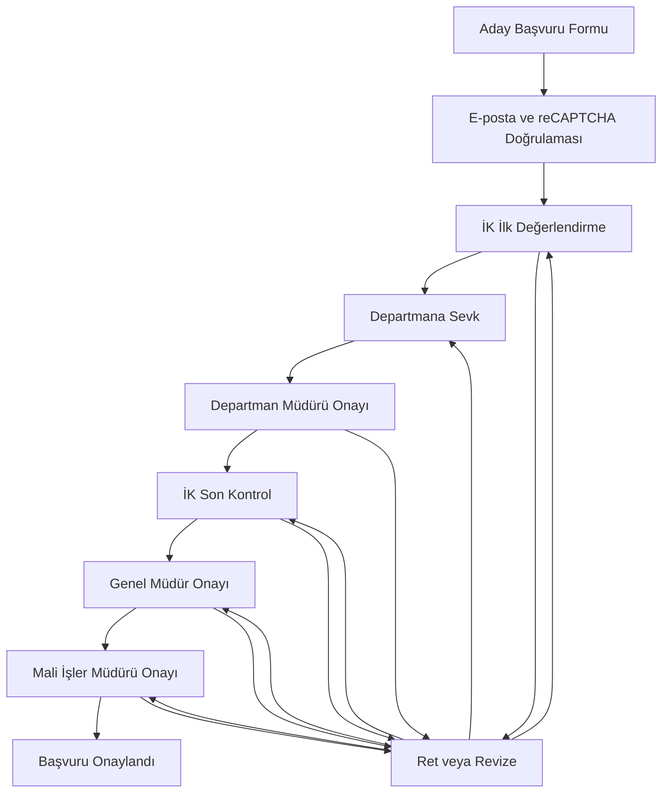
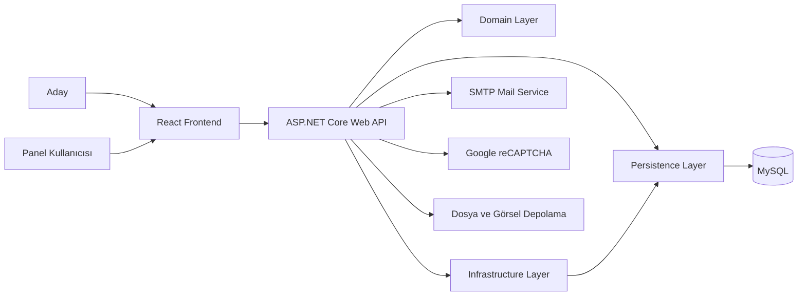

# Chamada Job Application

Chamada Job Application; aday başvurularının dijital ortamda alınması, doğrulanması, değerlendirilmesi ve kurum içerisindeki çok aşamalı onay sürecinin yönetilmesi için geliştirilmiş kapsamlı bir işe alım ve başvuru yönetim sistemidir.

Sistem iki temel bölümden oluşur:

* Adayların kullanabildiği çok adımlı iş başvuru formu
* İnsan Kaynakları ve yönetim kadrosunun kullandığı rol bazlı yönetim paneli

Proje; aday bilgilerinin toplanmasından departman değerlendirmesine, revize taleplerinden genel müdür ve mali işler onayına kadar işe alım sürecinin uçtan uca yönetilmesini amaçlar.

---

## Temel Özellikler

### Aday Başvuru Sistemi

* Türkçe ve İngilizce dil desteği
* Çok bölümlü iş başvuru formu
* Vesikalık fotoğraf yükleme
* Kişisel ve iletişim bilgileri
* Doğum, ikametgâh ve uyruk bilgileri
* Eğitim bilgileri
* İş deneyimleri
* Yabancı dil bilgileri
* Sertifikalar
* Bilgisayar ve program bilgileri
* Referans bilgileri
* Ehliyet ve KKTC belge bilgileri
* Şube, alan, departman ve pozisyon tercihleri
* Oyun ve program bilgileri
* Lojman talebi
* E-posta doğrulama kodu
* KVKK ve referans araştırması onayları
* Google reCAPTCHA doğrulaması
* Formun güncellenebilmesi
* Başvurunun doğrulanan e-posta adresiyle tekrar görüntülenebilmesi

### Yönetim Paneli

* Rol bazlı kullanıcı yetkilendirmesi
* Başvuru listeleme ve detay görüntüleme
* Arama, sıralama, filtreleme ve sayfalama
* Başvuruları şube, alan, departman ve aşamaya göre filtreleme
* Aday CV önizleme
* PDF ve Excel çıktıları
* Aday fotoğrafı önizleme
* Başvuruyu bir veya birden fazla departmana sevk etme
* Departman değerlendirme işlemleri
* Onay, ret ve revize işlemleri
* Bekleyen işlem bildirimleri
* Başvuru işlem geçmişi
* Kullanıcı işlem logları
* IP ve onay kayıtları
* Panel kullanıcı yönetimi
* Rol ve yetki yönetimi
* Şirket organizasyon yapısı yönetimi
* Şube, alan, departman ve pozisyon tanımları
* Form metinleri ve KVKK açıklamalarının yönetimi
* Personel görev ve maaş atama işlemleri
* Pozisyon bütçesi ve kadro bilgilerinin yönetimi
* Referans araştırması kayıtları

---

## Başvuru Onay Akışı

Başvurular rol ve organizasyon bilgilerine göre aşamalı olarak değerlendirilir.



Revize mekanizması sayesinde hatalı veya yeniden değerlendirilmesi gereken kararlar, yetkili kullanıcıların onayından sonra ilgili aşamaya geri gönderilebilir.

Tamamen reddedilen bir başvuru İK grubu tarafından:

* Kaldığı aşamadan devam ettirilebilir
* İK ilk değerlendirme aşamasına döndürülebilir
* Yeniden tamamen reddedilebilir

---

## Kullanıcı Rolleri

| Rol                   | Temel Yetkiler                                                                   |
| --------------------- | -------------------------------------------------------------------------------- |
| **SuperAdmin**        | Sistemdeki tüm şube, alan, departman, kullanıcı ve başvurular üzerinde tam yetki |
| **Admin**             | Başvuru ve yönetim süreçlerini yönetme                                           |
| **İK Admin**          | İnsan Kaynakları süreçlerini yönetme ve revize kararlarını değerlendirme         |
| **İK**                | Başvuruları inceleme, departmanlara sevk etme ve son kontrol işlemleri           |
| **Departman Müdürü**  | Kendi departmanına sevk edilen başvuruları değerlendirme                         |
| **Genel Müdür**       | İK son kontrolünden geçen başvuruları değerlendirme                              |
| **Mali İşler Müdürü** | Genel müdür onayından geçen başvuruların mali değerlendirmesini yapma            |
| **Başvuru Yapan**     | Doğrulanan e-posta adresiyle kendi başvurusunu görüntüleme ve güncelleme         |

Yetkilendirme yalnızca arayüz seviyesinde değil, backend tarafında JWT rol claim’leri ve organizasyon filtreleriyle de uygulanır.

---

## Çoklu Departman İşleyişi

Bir aday birden fazla departman veya pozisyon için değerlendirilebilir.

* İK, başvuruyu bir veya birden fazla departmana sevk edebilir.
* Departman müdürleri yalnızca yetkili oldukları departmana ait başvuruları görür.
* Departmanlardan biri başvuruyu onayladığında diğer sevkler geçici olarak pasif hâle getirilebilir.
* Üst onay aşamalarında ret verilmesi durumunda diğer uygun departman seçenekleri tekrar aktifleştirilebilir.
* Departman kararları, üst aşama kararları ve revize işlemleri ayrı ayrı loglanır.

---

## Sistem Mimarisi

Proje katmanlı mimari yaklaşımıyla geliştirilmiştir.



### Backend Katmanları

| Katman                     | Açıklama                                                            |
| -------------------------- | ------------------------------------------------------------------- |
| `IsBasvuru.Domain`         | Entity, DTO, enum, interface ve ortak response modelleri            |
| `IsBasvuru.Infrastructure` | İş kuralları, servisler, mail, doğrulama ve yardımcı araçlar        |
| `IsBasvuru.Persistence`    | Entity Framework Core context ve veritabanı erişimi                 |
| `IsBasvuru.WebAPI`         | Controller, middleware, validation, mapping ve API yapılandırmaları |

### Frontend Yapısı

Frontend; bileşen, servis ve sorumluluk temelli klasörlere ayrılmıştır.

| Klasör                   | Açıklama                                 |
| ------------------------ | ---------------------------------------- |
| `src/components/Users`   | Aday başvuru formu ve form bölümleri     |
| `src/components/Admin`   | Yönetim paneli ve başvuru yönetimi       |
| `src/components/Layouts` | Kullanıcı ve yönetim paneli yerleşimleri |
| `src/services`           | Backend API servisleri                   |
| `src/api`                | Axios ve API istemci yapılandırmaları    |
| `src/auth`               | Oturum ve kullanıcı bilgisi yönetimi     |
| `src/routes`             | Korumalı rotalar ve rol kontrolleri      |
| `src/schemas`            | Zod form doğrulama şemaları              |
| `src/i18n`               | Çoklu dil kaynakları                     |
| `src/utils`              | Ortak yardımcı fonksiyonlar              |

---

## Proje Dizini

```text
ChamadaJobApplicationPublic/
├── IsBasvuru/
│   ├── IsBasvuru.Domain/
│   ├── IsBasvuru.Infrastructure/
│   ├── IsBasvuru.Persistence/
│   ├── IsBasvuru.WebAPI/
│   ├── IsBasvuru.slnx
│   └── global.json
│
├── is-basvuru-app/
│   ├── public/
│   ├── src/
│   ├── package.json
│   ├── vite.config.js
│   ├── tailwind.config.js
│   └── vercel.json
│
└── .gitignore
```

---

## Kullanılan Teknolojiler

### Frontend

* React 19
* Vite 7
* JavaScript
* Tailwind CSS 4
* Material UI
* React Router
* React Hook Form
* Zod
* Axios
* TanStack Table
* i18next
* SweetAlert2
* React Toastify
* Font Awesome
* jsPDF
* html2pdf.js
* SheetJS / XLSX
* Google reCAPTCHA

### Backend

* .NET 8
* ASP.NET Core Web API
* Entity Framework Core 8
* MySQL
* Pomelo Entity Framework Core MySQL
* JWT Bearer Authentication
* AutoMapper
* FluentValidation
* Serilog
* Swagger / OpenAPI
* ASP.NET Core Rate Limiting
* Magick.NET
* SMTP Mail Service

---

## Güvenlik Özellikleri

Projede uygulanan başlıca güvenlik önlemleri:

* JWT tabanlı kimlik doğrulama
* Rol bazlı endpoint yetkilendirmesi
* `HttpOnly`, `Secure` ve `SameSite=Strict` cookie desteği
* Login işlemleri için rate limiting
* Google reCAPTCHA doğrulaması
* CORS origin kontrolü
* HTTPS yönlendirmesi
* HSTS desteği
* Global exception handling middleware
* FluentValidation ile backend doğrulaması
* Zod ile frontend doğrulaması
* Güvenlik response header’ları
* IP adresi ve kullanıcı cihazı kaydı
* KVKK onay kaydı
* Yapılandırılmış Serilog kayıtları
* JWT süre ve issuer/audience doğrulaması

Kullanılan güvenlik header’ları:

* `X-Frame-Options`
* `X-Content-Type-Options`
* `X-XSS-Protection`
* `Referrer-Policy`

---

## Loglama ve İzlenebilirlik

Sistem içerisindeki önemli işlemler kayıt altına alınır.

* Başvuru oluşturma
* Başvuru güncelleme
* Departmana sevk
* Departman değerlendirmesi
* Onay
* Ret
* Revize talebi
* Revize onayı veya reddi
* Kullanıcı işlemleri
* IP ve cihaz bilgileri
* KVKK onayları
* Sistem hataları

Serilog kayıtları günlük olarak JSON formatında oluşturulur ve belirlenen süre boyunca saklanır.

---

## Gereksinimler

Projeyi yerel ortamda çalıştırmak için:

* .NET 8 SDK
* Node.js
* npm
* MySQL Server
* Google reCAPTCHA anahtarları
* SMTP hesabı
* Git

---

## Kurulum

### 1. Repository’yi klonlayın

```bash
git clone https://github.com/MrYlcnky/ChamadaJobApplicationPublic.git
cd ChamadaJobApplicationPublic
```

### 2. Backend yapılandırması

Backend klasörüne geçin:

```bash
cd IsBasvuru/IsBasvuru.WebAPI
dotnet restore
```

Proje, gizli yapılandırma değerleri için .NET User Secrets veya environment variable kullanımına uygundur.

Örnek User Secrets tanımları:

```bash
dotnet user-secrets set "ConnectionStrings:DefaultConnection" "server=localhost;port=3306;database=IsBasvuruDb;user=root;password=YOUR_PASSWORD"

dotnet user-secrets set "JwtSettings:Key" "YOUR_LONG_AND_SECURE_JWT_KEY"

dotnet user-secrets set "EmailSettings:Password" "YOUR_SMTP_PASSWORD"

dotnet user-secrets set "Recaptcha:SecretKey" "YOUR_RECAPTCHA_SECRET_KEY"
```

Gerekli temel yapılandırmalar:

| Ayar                                  | Açıklama                         |
| ------------------------------------- | -------------------------------- |
| `ConnectionStrings:DefaultConnection` | MySQL bağlantı bilgisi           |
| `JwtSettings:Key`                     | JWT imzalama anahtarı            |
| `JwtSettings:Issuer`                  | Token issuer bilgisi             |
| `JwtSettings:Audience`                | Token audience bilgisi           |
| `EmailSettings`                       | SMTP sunucu ve hesap bilgileri   |
| `Recaptcha:SecretKey`                 | Backend reCAPTCHA gizli anahtarı |
| `Cors:AllowedOrigins`                 | Frontend adresleri               |

MySQL veritabanını oluşturun ve proje entity yapısıyla uyumlu veritabanı şemasını hazırlayın.

Backend’i başlatın:

```bash
dotnet run
```

Development ortamında Swagger arayüzüne aşağıdaki adres üzerinden ulaşılabilir:

```text
https://localhost:<API_PORT>/swagger
```

### 3. Frontend yapılandırması

Frontend klasörüne geçin:

```bash
cd ../../../is-basvuru-app
npm install
```

`is-basvuru-app` klasöründe `.env` dosyası oluşturun:

```env
VITE_API_BASE_URL=https://localhost:<API_PORT>
VITE_RECAPTCHA_SITE_KEY=YOUR_RECAPTCHA_SITE_KEY
```

Frontend’i başlatın:

```bash
npm run dev
```

Terminalde gösterilen Vite adresini tarayıcıda açın.

---

## Kullanılabilir Komutlar

### Frontend

```bash
npm run dev
```

Development sunucusunu başlatır.

```bash
npm run build
```

Production build oluşturur.

```bash
npm run lint
```

ESLint kontrollerini çalıştırır.

```bash
npm run preview
```

Production build’i yerel ortamda önizler.

### Backend

```bash
dotnet restore
```

NuGet paketlerini yükler.

```bash
dotnet build
```

Projeyi derler.

```bash
dotnet run
```

Web API’yi başlatır.

---

## API Dokümantasyonu

Development ortamında Swagger/OpenAPI desteği aktiftir.

Swagger üzerinden:

* Endpoint’ler görüntülenebilir
* Request ve response modelleri incelenebilir
* JWT Bearer token ile yetkili endpoint’ler test edilebilir
* DTO ve validation yapıları görüntülenebilir

Yetkili endpoint’leri test etmek için Swagger’daki **Authorize** alanına şu formatta token girilmelidir:

```text
Bearer YOUR_JWT_TOKEN
```

---

## Production Dağıtımı

Repository içerisinde:

* Frontend için Vercel yapılandırması
* Backend için IIS `web.config` yapılandırması
* Production CORS ayarları
* HTTPS ve HSTS desteği
* Serilog dosya loglaması

bulunmaktadır.

Canlı ortama geçmeden önce tüm gizli değerler environment variable veya güvenli secret yönetim sistemi üzerinden sağlanmalıdır.


---

## Public Repository Notu

Bu repository, projenin portföy ve kaynak kod inceleme amacıyla yayımlanmış public sürümüdür.

Bağlantı bilgileri, JWT anahtarları, SMTP parolaları ve reCAPTCHA gizli anahtarları repository içerisinde boş bırakılmıştır. Uygulamanın çalıştırılabilmesi için bu değerlerin yerel veya production ortamında ayrıca tanımlanması gerekir.

---

## Geliştirici

**Mehmet Yalçınkaya**

* GitHub kullanıcı adı: `MrYlcnky`
* Proje: Chamada Job Application
* Teknolojiler: React, ASP.NET Core, Entity Framework Core ve MySQL

---

## Lisans

Bu repository için henüz açık kaynak lisansı tanımlanmamıştır.

Kaynak kodun kullanımı, dağıtımı veya değiştirilmesi için proje sahibinden izin alınması gerekebilir.
